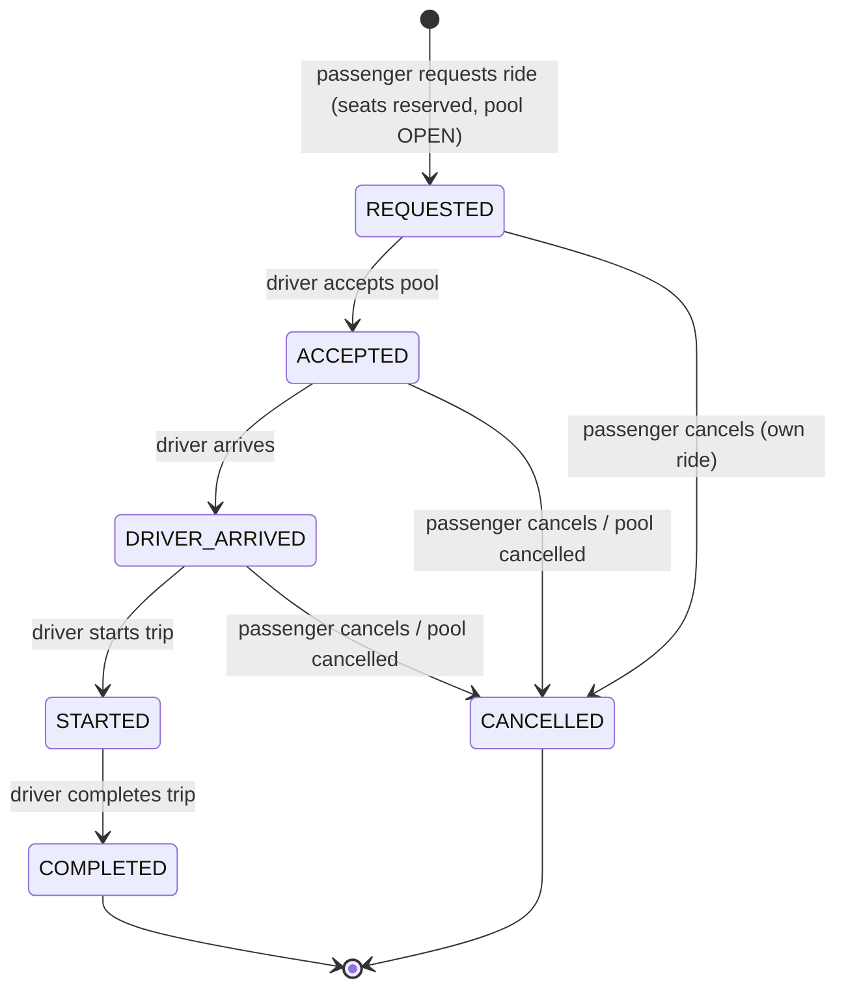

# PRD — Dhaka Tesla Pool (MVP)

| Field | Value |
|---|---|
| Status | **Draft — awaiting human review** |
| Stage | Documentation only (no application code) |
| Brief source | The original brief file was **not found in the repository**; this PRD treats the two master prompts as the authoritative extraction of the brief. See [traceability.md](traceability.md) → Assumption **A-00**. |
| Related docs | [requirements](requirements.md) · [architecture](architecture.md) · [tech-stack](tech-stack.md) · [database](database.md) · [api](api.md) · [ui-ux](ui-ux.md) · [security](security.md) · [testing](testing.md) · [deployment](deployment.md) · [traceability](traceability.md) · [todo](../todo.md) |

## 1. Product Overview

**Product name:** Dhaka Tesla Pool (the brief's scaling section refers to it as *"Oi Tesla"*).

**Purpose:** A ride-pooling MVP for Dhaka where several passengers share one Tesla along the same route. Each passenger has an individual fare and an individual ride status, while the pool as a whole moves through one shared trip with a strictly enforced fixed seat capacity.

**Problem being solved:** In Dhaka, passengers going the same way often ride separately, paying full fare for a half-empty trip. This MVP demonstrates a safe pooling system: one Tesla ("Bullet", driven by Jashim) fills up with compatible passengers (Nusrat, Rafiq, Shirin), each pays a discounted individual fare, and the system guarantees the car never exceeds its seat count even under concurrent requests.

**Target users (MVP):**
- **Passengers** in Dhaka who request point-to-point rides between a fixed set of city zones.
- **A driver (Jashim)** operating one Tesla ("Bullet") who accepts pools and drives them to completion.

**MVP scope in one paragraph:** Email/password auth with two roles (PASSENGER, DRIVER); a passenger requests a ride by picking pickup zone, destination zone, and number of seats; the system deterministically matches the request to an existing open pool or creates one; a driver accepts the pool, arrives, starts, and completes the trip; fares are computed per passenger with a pool discount and stored as integers; payment is simulated; both roles see ride history; the whole system runs with `docker compose up` and is documented, tested (including a concurrency test), and deployed on free-tier services.

## 2. Actors

The story cast is fixed across every document and every seed/test dataset. Never replace them with `user1`/`driver1`.

| Actor | Type | Role | Description |
|---|---|---|---|
| **Jashim** | Human | `DRIVER` | The driver. Owns the Tesla, goes online, sees open pools, accepts → arrives → starts → completes. |
| **Bullet** | Machine | — | Jashim's Tesla. Fixed seat capacity (`seat_capacity = 3` bookable pool seats, configurable — see [traceability.md](traceability.md) A-02). Must never exceed capacity. |
| **Nusrat** | Human | `PASSENGER` | Demo passenger #1. Requests Banani → Dhanmondi, 1 seat. |
| **Rafiq** | Human | `PASSENGER` | Demo passenger #2. Requests the same corridor, joins Nusrat's pool. |
| **Shirin** | Human | `PASSENGER` | Demo passenger #3. Joins to fill the last seat; also the second contender in the concurrency test. |
| **Ride / Pool** | System object | — | A *pool* is one concrete shared trip (vehicle + driver + corridor + state). A *ride request* is one passenger's membership in a pool, with its own status and fare. |

## 3. User Problems

**Passenger (Nusrat, Rafiq, Shirin):**
- Cannot tell whether a car going their way has free seats before committing.
- Has no clear, trustworthy fare figure before requesting; wants the price split fairly when sharing.
- Cannot see ride status ("is the driver coming? did the trip start?") without calling anyone.
- Has no record of past rides, fares, or payments.

**Driver (Jashim):**
- Manually coordinates "who is going where" and risks overloading the car.
- Has no single screen showing which pools are waiting, who is in the car, and what each passenger owes.
- Cannot enforce seat capacity reliably when two passengers ask for the last seat simultaneously.

**Pool / Ride system:**
- Must keep `seats_taken ≤ seat_capacity` under concurrent requests (the brief's explicit scenario: *Bullet has one seat left and Nusrat and Shirin simultaneously attempt to claim it*).
- Must reject invalid state transitions (e.g., completing a ride that never started).
- Must prevent one passenger from touching another passenger's ride.
- Must produce identical fare results for identical inputs, forever (evaluators will recompute them by hand).

## 4. Goals

Measurable MVP goals (each has an owner artifact — a doc section, a test, or the demo video):

| # | Goal | How measured |
|---|---|---|
| G1 | Clone → running system in under 15 minutes | [deployment.md](deployment.md) §1 followed literally by a fresh evaluator |
| G2 | Bullet **never** exceeds `seat_capacity`, even under concurrent joins | concurrency test ([testing.md](testing.md) §6), 100 parallel runs, 0 overbooks |
| G3 | Full demo scenario end-to-end in under 3 minutes | §16 executed in the demo video |
| G4 | Fares hand-verifiable: evaluator recomputes Nusrat's and Rafiq's fare from the formula and gets the exact DB value | §12 + `fares` rows |
| G5 | Every significant brief requirement maps to doc → implementation → test | [traceability.md](traceability.md), 0 empty cells |
| G6 | Automated suite (unit + integration + concurrency) runs in < 2 minutes | `npm test` |
| G7 | Zero unauthorized-access paths | authz matrix tests ([testing.md](testing.md) §5) |

## 5. Non-Goals (explicitly NOT in the MVP)

- Real Google Maps routing, GPS coordinates, turn-by-turn navigation — geography is 8 named zones + a seeded km table.
- Real payment gateway (bKash/Stripe/card) — payment is a simulated state transition.
- Real-time vehicle tracking, WebSocket push, live driver map — status updates are polled every 3 s.
- Advanced dispatching, multi-driver optimization, surge pricing, ETA prediction, ML matching.
- Large-scale distributed infrastructure: microservices, Kafka, Kubernetes, Redis, dedicated queues, event sourcing — prohibited by the brief unless justified; nothing here justifies them ([architecture.md](architecture.md) §11).
- Ratings/reviews, in-app chat, push/SMS notifications, referrals, coupons.
- Native mobile apps, internationalization, formal WCAG AA audit (accessibility basics only).
- Commercial production use of free-tier hosts (Vercel Hobby is non-commercial — acceptable for an assessment).

## 6. Core Features

| # | Feature | Key requirement IDs |
|---|---|---|
| F1 | Registration / login (2 roles) | FR-AUTH-001…005 |
| F2 | Passenger dashboard with active ride | FR-PASSENGER-001 |
| F3 | Ride request: pickup zone, destination zone, seats | FR-PASSENGER-002 |
| F4 | Estimated fare before requesting | FR-FARE-001 |
| F5 | Deterministic ride matching (pool found or created) | FR-POOL-001…002 |
| F6 | Pool creation / joining | FR-POOL-002 |
| F7 | Tesla capacity enforcement (atomic, race-safe) | FR-POOL-004 |
| F8 | Driver online/offline for Bullet | FR-DRIVER-001 |
| F9 | Driver acceptance of a pool | FR-DRIVER-002 |
| F10 | Driver arrival → start → completion | FR-DRIVER-003…004 |
| F11 | Cancellation (own ride, pre-start) | FR-PASSENGER-005 |
| F12 | Individual passenger fare (estimate → final) | FR-FARE-002…003 |
| F13 | Simulated payment | FR-PAYMENT-001…002 |
| F14 | Passenger ride history | FR-HISTORY-001 |
| F15 | Driver ride history | FR-HISTORY-002 |

## 7. User Journeys

**Passenger — Nusrat shares with Rafiq:** login → dashboard (empty) → *Request ride*: **Banani → Dhanmondi**, 1 seat → estimate `৳115.20` shown with the pool assumption → submit → `REQUESTED`, seats held in an `OPEN` pool. Rafiq requests the same corridor → joins **the same pool** (2/3). Jashim accepts → both `ACCEPTED`; arrives → `DRIVER_ARRIVED`; starts → `STARTED` (cancel hidden); completes → `COMPLETED`, fares finalize at `11520` poisha each. Nusrat taps **Pay (simulated)** → `PAID`, then finds the ride, fare, and payment in `/passenger/rides`.

**Driver — Jashim in Bullet:** login as DRIVER → dashboard → toggle **Online** (Bullet `ONLINE`; required before requests can be created) → *Requests* shows the open Banani → Dhanmondi pool (Nusrat + Rafiq, 2/3) → **Accept → Arrive → Start → Complete**, each button enabled only by current state → pool detail lists both passengers and their individual `11520` poisha fares → `/driver/history` shows the completed pool and collected totals (simulated).

## 8. Ride Lifecycle

The brief's lifecycle is implemented as-is (decision note below):



- **`REQUESTED`** = waiting phase: seats are already reserved in an `OPEN` pool; the pool assignment is visible as `poolId` on the ride and recorded in status history with reason `MATCHED`.
- **`ACCEPTED`** = the brief's *MATCHED / ACCEPTED* state: Jashim confirmed the pool. We keep the brief's single state rather than splitting it, because matching is already observable (poolId + status-history row) and fewer states mean a smaller authorization/transition matrix to defend ([architecture.md](architecture.md) §5).
- **`CANCELLED`** = the brief's alternative state, reachable from any state **before** `STARTED`; forbidden afterwards (`RIDE_ALREADY_STARTED`).
- Pools use the same states with `OPEN` as the pre-acceptance phase: `OPEN → ACCEPTED → DRIVER_ARRIVED → STARTED → COMPLETED` (+ `CANCELLED`).

## 9. Status Semantics (pool ⇄ ride mapping)

| Pool status | All its active ride_requests | Meaning (UI copy) |
|---|---|---|
| `OPEN` | `REQUESTED` | Seats held; waiting for Jashim |
| `ACCEPTED` | `ACCEPTED` | Driver confirmed; on the way |
| `DRIVER_ARRIVED` | `DRIVER_ARRIVED` | Jashim has arrived |
| `STARTED` | `STARTED` | Trip in progress (cancel disabled) |
| `COMPLETED` | `COMPLETED` | Trip done; fares final; payment pending |
| `CANCELLED` | `CANCELLED` | Trip abandoned (or last member left) |

A cancelled passenger's ride stays `CANCELLED` even while its pool continues — statuses and fares are **per passenger**, as the brief requires.

## 10. Geography Model

Eight fixed Dhaka zones (no coordinates, no routing, no external maps API):

```text
Banani · Gulshan · Mohakhali · Dhanmondi · Mirpur · Uttara · Farmgate · Bashundhara
```

- Zones live in a `zones` table; every request references two of them (pickup ≠ destination).
- Distance = integer km from the seeded `zone_distances` table (28 unordered pairs, `CHECK zone_a < zone_b`). **Banani ↔ Dhanmondi = 7 km** drives the demo fare.
- Matching, fare, and the evaluator's manual calculation are all deterministic and offline — the brief's geography requirement without a maps project (decision **ADR-004**).

## 11. Matching Rules

A ride request may join an existing pool **iff all five hold**:

1. pool `status = OPEN` (still accepting members),
2. same `pickup_zone` **and** same `destination_zone` (ordered corridor),
3. requested seats fit: `seats_taken + seats ≤ seat_capacity`,
4. the pool's vehicle is `ONLINE`,
5. the caller has no other active ride (Assumption A-06).

**Otherwise, in order:** an `OPEN` pool exists for the corridor but is full → `409 POOL_CAPACITY_EXCEEDED`; no `OPEN` pool exists → create one (the partial unique index guarantees one `OPEN` pool per vehicle+corridor — if a racing request wins the insert, catch the unique violation and retry the join once); no vehicle `ONLINE` → `409 NO_VEHICLE_AVAILABLE`.

Transaction-level mechanics: [architecture.md](architecture.md) §6–§7.

## 12. Fare Model

### 12.1 Variables (single source: `config/rate-card.ts`)

| Variable | Value | Meaning |
|---|---|---|
| `currency` | BDT (৳) | Bangladeshi Taka; **stored as integer poisha** (৳1 = 100 poisha) — ADR-003 |
| `BASE_FARE` | `6000` poisha (৳60) | Flag-down charge per seat |
| `RATE_PER_KM` | `1200` poisha (৳12) | Distance charge per seat per km |
| `distance_km` | from `zone_distances` | Integer km for the ordered zone pair (e.g., Banani→Dhanmondi = **7**) |
| `POOL_DISCOUNT_PCT` | `20` % | Applies to the **subtotal**, only if the pool completes with **≥ 2 active members** (solo trip → 0) |
| `MIN_FARE` | `5000` poisha (৳50) | Floor guard (unreachable under current rates — documented so rate changes stay safe) |
| `seats` | 1…3 | Requested seats; **per-seat fare × seats = passenger total** |

### 12.2 Formula (integer poisha, floor rounding)

```text
subtotal           = BASE_FARE + (distance_km × RATE_PER_KM)
poolDiscount       = floor(subtotal × POOL_DISCOUNT_PCT ÷ 100)   // 0 if <2 members complete
passengerFareSeat  = max(MIN_FARE, subtotal − poolDiscount)      // per seat
totalDue           = passengerFareSeat × seats
```

### 12.3 Worked example (evaluator can verify by hand)

Banani → Dhanmondi = 7 km, 1 seat, pool completes with Nusrat + Rafiq:

```text
subtotal        = 6000 + (7 × 1200) = 6000 + 8400 = 14400 poisha   (৳144.00)
poolDiscount    = floor(14400 × 20 ÷ 100) = 2880 poisha            (৳28.80)
passengerFare   = 14400 − 2880 = 11520 poisha                      (৳115.20)  ← Nusrat
                                                              Rafiq = 11520 too
```

Two individual `fares` rows, identical amounts, one per passenger — while a **solo** completion (the other member cancelled) yields `14400` (no discount). Estimates returned before requesting use the same math flagged `assumesPoolSize: 2`.

**Rounding:** only the percentage step rounds, always **down** (floor) — the house never overcharges a fraction that doesn't exist; every other operation is exact integer arithmetic. **Cancellation fee:** none in MVP (§14); adding one later = new constant + branch in the same service, covered by tests.

## 13. Payment Model (simulated)

- On `COMPLETED`, one `payments` row per active member: `amount_poisha` = final fare, `status = PENDING`, `method = SIMULATED`.
- Passenger taps **Pay (simulated)** → `POST /rides/:id/payment/simulate` → `PAID` + `paid_at`. Repeat = same result (idempotent).
- No gateway, no card data, no webhooks — the brief requires a *simulated* payment; the state machine, authorization, and history around it are real.
- Driver dashboard/report shows paid vs pending totals (informational; no driver payout logic).

## 14. Cancellation Rules

| Who | When | Effect |
|---|---|---|
| Passenger | own ride, status `REQUESTED`/`ACCEPTED`/`DRIVER_ARRIVED` | ride `CANCELLED`, membership `CANCELLED`, seats freed atomically; if pool has 0 active members left → pool `CANCELLED` |
| Passenger | own ride, `STARTED` or later | ❌ `409 RIDE_ALREADY_STARTED` |
| Driver | own pool, before `STARTED` | pool + all active rides `CANCELLED` (driver no-show / Bullet breaks down) |
| Anyone else | never | `404` (ownership scope) |

- **No cancellation fee** in MVP (explicit decision — see Assumption A-07).
- Other members' rides, seats, and fares are never affected by one member's cancellation.
- Every cancellation writes a `ride_status_history` row with reason (`PASSENGER_CANCELLED` / `DRIVER_CANCELLED` / `POOL_EMPTY`).

## 15. Ride History

- **Passenger:** `/passenger/rides` ← `GET /rides?status=COMPLETED` (paginated): date, corridor, status, seats, final fare, payment status. Detail page keeps the full timeline even after completion.
- **Driver:** `/driver/history` ← `GET /driver/pools?status=COMPLETED`: completed pools with roster and per-passenger fares + collected totals.
- History is read-only; rows are never hard-deleted (cancelled rides stay visible with `CANCELLED` status — the brief wants lifecycle visibility, not cleanup).

## 16. Demo Scenario

**Preconditions:** `docker compose up` healthy, seed complete, all zones present. Logged in on two browser profiles (or one browser + one incognito): **Nusrat** (passenger) and **Jashim** (driver).

| # | Actor | Action | Expected (verifiable on screen) |
|---|---|---|---|
| 1 | Jashim | login → driver dashboard → **Go Online** | Bullet `ONLINE` chip green |
| 2 | Nusrat | login → **Request ride**: Banani → Dhanmondi, 1 seat | estimate **৳115.20** with "assumes 2+ passengers" note |
| 3 | Nusrat | submit | status `REQUESTED`, "seats held (1/3)", timeline step 1 lit |
| 4 | Rafiq (2nd profile) | same request, same corridor | joins **same pool** → `2/3` seats visible to Jashim |
| 5 | Jashim | Requests queue → **Accept** | both rides `ACCEPTED`; Nusrat's screen flips without reload (≤ 3 s poll) |
| 6 | Jashim | **Arrive** → Nusrat sees `DRIVER_ARRIVED` | timeline step 3 |
| 7 | Jashim | **Start** → cancel button disappears for Nusrat | `STARTED`; attempts to cancel via API → `409 RIDE_ALREADY_STARTED` |
| 8 | Jashim | **Complete** | pool + both rides `COMPLETED`; fares finalize: **৳115.20 each** (DB: `11520` poisha); payments `PENDING` |
| 9 | Nusrat | **Pay (simulated)** | `PAID` badge; repeat click → still one `PAID` row |
| 10 | Nusrat | `/passenger/rides` | ride + fare + payment in history; Jashim's `/driver/history` shows the pool |
| 11 | (optional) | concurrency proof: Shirin joins when 1 seat is left, alongside a rival request | one `201`, one `409 POOL_CAPACITY_EXCEEDED`, seats `3/3` — as shown by `npm run test:concurrency` |

Target duration: **under 3 minutes** for steps 1–10 (Goal G3).

## 17. Acceptance Criteria (by feature)

| Feature | Acceptance criteria (each backed by a test in testing.md) |
|---|---|
| Registration/login | register → login → `/auth/me` round-trip; duplicate email `409`; bad password `401`; role gate `403` |
| Ride request | valid → `201` with `poolId` + estimate; invalid zone/same zone → `400`; offline vehicle → `409 NO_VEHICLE_AVAILABLE` |
| Matching | Nusrat + Rafiq same corridor → one shared `pool_id`; different corridor → different pool |
| Capacity | last-seat race → exactly one winner, `seats_taken ≤ 3` always (100-run loop) |
| Driver accept | pool + all active members flip atomically; repeat/out-of-order → `409 ILLEGAL_STATE_TRANSITION` |
| Trip progression | arrive/start/complete only from legal states; each writes status history |
| Fare | hand-computed ৳115.20 == DB `total_poisha`; solo completion → no discount; integer-only arithmetic |
| Payment | `PENDING → PAID` once, idempotent; pre-completion payment → `409` |
| Cancellation | pre-start cancels free seats + may cancel empty pool; post-start → `409`; others unaffected |
| Authorization | passenger↔passenger `404`, wrong role `403`, no token `401` (full matrix: testing.md §5) |
| History | passenger and driver histories list only own records, paginated, read-only |
| Deployment | `docker compose up` from clean clone → all healthchecks green → demo runs |
| Concurrency docs | architecture §7 explanation matches observed test behaviour |

## 18. MVP Scope

### Must Have (ship or fail)
Auth (2 roles) · zones + distance table · ride request with pickup/destination/seats · deterministic matching · pool create/join · **atomic capacity enforcement** · driver accept/arrive/start/complete · per-passenger state machine + status history · fare estimate + final integer fare with pool discount · simulated payment · cancellation (pre-start) · passenger + driver history · REST API per api.md · Next.js UI per ui-ux.md · unit/integration/authz/concurrency/E2E tests · Docker Compose (`docker compose up`) · migrations + idempotent seed · `.env.example` · health checks · README (setup, API, testing, deployment, AI usage) · docs/ set + this PRD · demo video · git branch/commit conventions · traceability with no missing rows.

### Should Have
Driver pool cancel · `clientRequestId` idempotency · rate limiting · `/health/ready` · pagination everywhere · CI running tests on PR · Pino request logs with request ids.

### Optional / Bonus
Second driver/vehicle · pool waitlist when full · cancellation fee constant · SSE live updates instead of polling · admin/ops view · seed script for 25 history rides · screenshots in README.

### Out of Scope
Everything in §5 Non-Goals — real maps, real payments, real-time tracking, dispatch optimization, distributed infrastructure, mobile apps, multi-tenant/multi-city, commercial deployment.