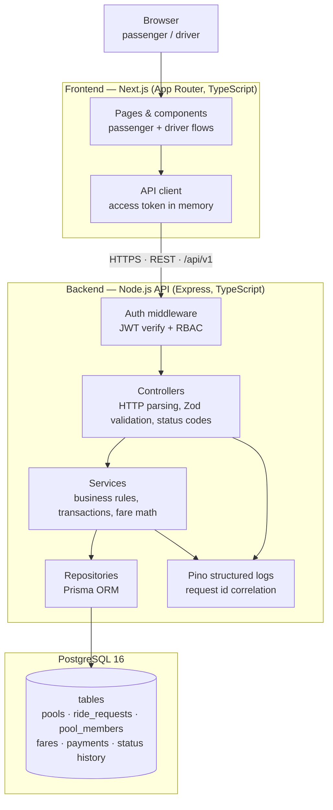
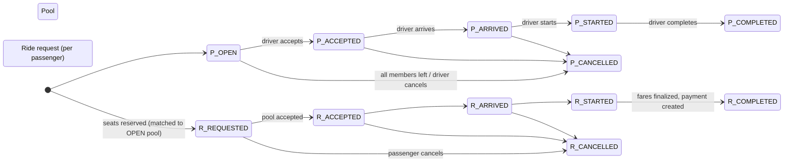
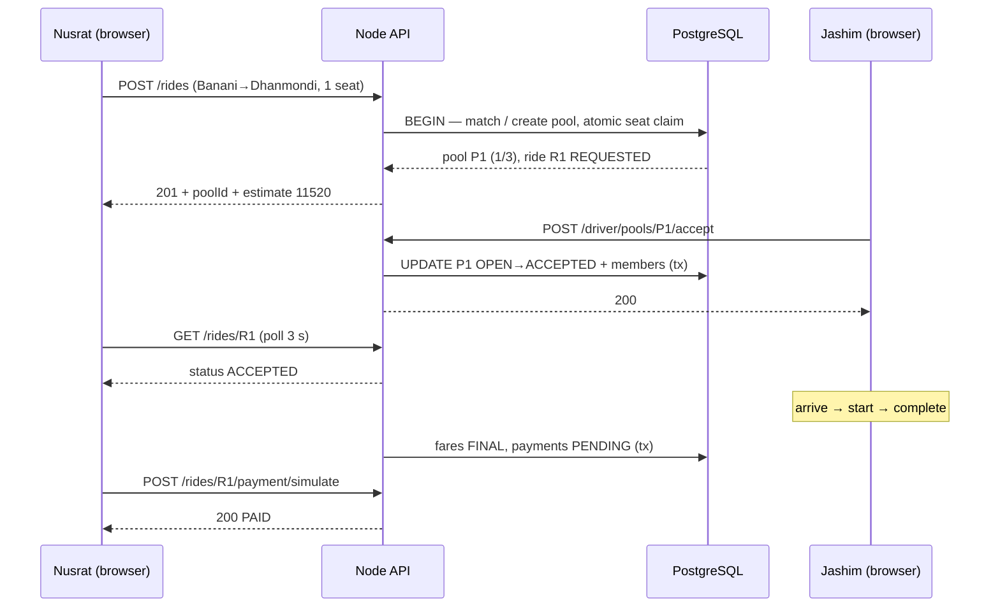

# System Architecture — Dhaka Tesla Pool (MVP)

Companion documents: [requirements](requirements.md) · [tech-stack](tech-stack.md) · [database](database.md) · [api](api.md) · [security](security.md) · [traceability](traceability.md)

## 1. Mandated structure

The brief mandates this chain, and the MVP follows it exactly:

```text
Browser
   ↓
Next.js / React
   ↓
Node.js API
   ↓
Database
```

No microservices, no Kafka, no Kubernetes, no Redis, no complex event or real-time infrastructure. Every component below exists because a documented requirement needs it; anything else is listed in §9 ("If Oi Tesla Goes Viral") as a _future_ change with an explicit trigger.

## 2. Container and component diagram



**External services:** none at runtime. Payment is simulated in-database; geography is a seeded table of Dhaka zones. (Deployment-time services — Vercel/Render/Neon — are described in [deployment.md](deployment.md).)

## 3. Layer responsibilities

| Layer                                 | Owns                                                                                                                                                         | Never does                                                      |
| ------------------------------------- | ------------------------------------------------------------------------------------------------------------------------------------------------------------ | --------------------------------------------------------------- |
| **Frontend (Next.js)**                | Rendering, routing, form state, calling the API, holding the access token in memory, redirecting on `401`, optimistic-free (server state is refetched)       | Business rules, fare math, capacity decisions, direct DB access |
| **Auth middleware**                   | Verifying JWT, attaching `req.user`, role checks (`PASSENGER`/`DRIVER`)                                                                                      | Ownership checks (that belongs to services), business errors    |
| **Controllers**                       | Parsing/validating input with Zod, calling exactly one service method, mapping results/errors to HTTP status codes                                           | SQL, business rules, `try/catch` that hides errors              |
| **Services**                          | All business rules: matching, capacity, state machines, fare calculation, authorization-by-ownership, transactions                                           | HTTP concepts (no `req`/`res` beyond what controllers pass in)  |
| **Repositories (Prisma)**             | Typed queries, transactions (`$transaction`), atomic conditional updates                                                                                     | Business decisions                                              |
| **Error handler (single middleware)** | Converting known error types to `{success:false, error:{code,message}}`, logging unknowns with stack + request id, returning `500` without leaking internals | —                                                               |
| **Logging**                           | Pino JSON logs: request id, method, path, status, duration, user id, error code                                                                              | Passwords, tokens, PII beyond user id                           |

## 4. Backend structure (why Controller → Service → Repository)

```text
src/
├── server.ts            # bootstrap: env validation, app, listen
├── app.ts               # express app: middleware, routes, error handler
├── config/              # env schema (Zod), constants (rate card)
├── modules/
│   ├── auth/            # controller · service · repository · routes
│   ├── rides/           # same shape
│   ├── pools/           # same shape
│   ├── fares/
│   ├── payments/
│   ├── vehicles/
│   └── zones/
├── shared/              # error types, logger, auth middleware, pagination
└── db/                  # prisma client, seed
```

**Why this shape:** the brief rewards understandable, testable code. Controllers are thin (easy to integration-test with Supertest), services hold the risky logic (unit-testable without HTTP or DB), repositories isolate Prisma (swap or mock the data layer). It is the same split NestJS would enforce, without NestJS's decorator/DI ceremony — see [tech-stack.md](tech-stack.md) for the alternatives comparison.

**Why not hexagonal/onion full architecture:** for an MVP of this size the extra ports-and-adapters indirection costs more than it buys; the service layer already gives us a seam for mocking.

## 5. Ride lifecycle (as implemented)

Both entities carry status; ride statuses are per-passenger (the brief requires individual status), pool statuses drive driver actions.



**Transition table (who may trigger what):**

| #   | From                                    | To               | Actor                    | Guard                                                                                                   |
| --- | --------------------------------------- | ---------------- | ------------------------ | ------------------------------------------------------------------------------------------------------- |
| 1   | —                                       | `REQUESTED`      | Passenger                | create + successful match/join (seats reserved, pool `OPEN`)                                            |
| 2   | `REQUESTED`                             | `ACCEPTED`       | Driver (pool owner)      | pool is `OPEN` → all active members follow the pool                                                     |
| 3   | `ACCEPTED`                              | `DRIVER_ARRIVED` | Driver                   | pool is `ACCEPTED`                                                                                      |
| 4   | `DRIVER_ARRIVED`                        | `STARTED`        | Driver                   | pool is `DRIVER_ARRIVED`                                                                                |
| 5   | `STARTED`                               | `COMPLETED`      | Driver                   | pool `STARTED` → all active members `COMPLETED`, fares finalized, payments created `PENDING`            |
| 6   | `REQUESTED`/`ACCEPTED`/`DRIVER_ARRIVED` | `CANCELLED`      | Passenger (own) / Driver | forbidden once `STARTED` → `409 RIDE_ALREADY_STARTED`; seats freed atomically; empty pool → `CANCELLED` |

**Why we did not restructure the brief's lifecycle:** the brief allows improvement only with a concrete engineering reason; we found none that outweighs the cost. Splitting _MATCHED_ from _ACCEPTED_ would duplicate information already carried by `poolId` + the status-history row (`reason: MATCHED`), while doubling the transition matrix, the UI states, and the tests an evaluator must verify. Every transition above is a single conditional update (§7), so the machine stays trivially auditable.

## 6. Ride pool flow — exact end-to-end sequence

1. **Passenger requests ride** — `POST /api/v1/rides {pickupZone, destinationZone, seats}` after seeing `POST /fare/estimate`.
2. **System validates request** — Zod schema; zones exist and differ; seats 1…`seat_capacity`; caller has no active ride; a vehicle is `ONLINE`.
3. **Matching occurs** — inside one DB transaction: `SELECT` candidate `OPEN` pools for the ordered corridor with `seats_taken + seats ≤ seat_capacity`.
4. **Existing pool found or created** — found → step 5; none → `INSERT` a pool (`OPEN`, capacity snapshotted from Bullet). If the partial unique index rejects the insert (racing request created it), re-run step 3 once and join instead.
5. **Capacity is checked** — atomic claim (see §7): `UPDATE pools SET seats_taken = seats_taken + $n WHERE id = $1 AND seats_taken + $n <= seat_capacity`. Zero rows updated → `409 POOL_CAPACITY_EXCEEDED`, transaction rolls back, nothing persisted.
6. **Passenger joins pool** — `pool_members` row (`ACTIVE`, seats = n) + `ride_requests` row (`REQUESTED`, `pool_id` set) inserted; `UNIQUE (ride_request_id) WHERE status='ACTIVE'` blocks duplicate membership by construction.
7. **Fare is calculated** — estimate computed from `zone_distances` + rate card, stored on the `fares` row (`ESTIMATED`), returned in the response; final numbers are written only at completion (§7 of [database.md](database.md)).
8. **Driver sees pool** — Jashim opens `/driver/requests`: `OPEN` pools for his vehicle with corridor, `seats_taken/seat_capacity`, members, estimate.
9. **Driver accepts** — `POST /driver/pools/:id/accept` → conditional update `OPEN → ACCEPTED` (0 rows → `409 ILLEGAL_STATE_TRANSITION`) → all active member rides → `ACCEPTED` + status-history rows, in the same transaction.
10. **Driver arrives** — `POST …/arrive`: `ACCEPTED → DRIVER_ARRIVED` (pool + active members).
11. **Ride starts** — `POST …/start`: `DRIVER_ARRIVED → STARTED`; cancellation endpoints now refuse.
12. **Ride completes** — `POST …/complete`: `STARTED → COMPLETED`; each active member's fare finalizes (discount iff ≥ 2 active members complete), a `PENDING` payment row is created per member, status history appended.

Sequence overview:



## 7. Concurrency — the last seat of Bullet

**The brief's scenario:** Bullet has one seat left; **Nusrat and Shirin simultaneously attempt to claim it.** Exactly one must win.

**Why the naive approach fails:** read `seats_taken` (2/3), both requests compute `2+1 ≤ 3` ✓, both insert members, both write `seats_taken = 3` — actually worse: both write 3 after each having read 2, and with a stale second read (`3+1 ≤ 3` never checked) a later write can persist `4`. This is a classic lost update; application-level `if` checks cannot fix it because the check and the write are not one atomic step.

**MVP mechanism — one atomic conditional UPDATE, inside one transaction:**

```sql
BEGIN;
UPDATE pools
   SET seats_taken = seats_taken + $n, updated_at = now()
 WHERE id = $pool_id
   AND status = 'OPEN'
   AND seats_taken + $n <= seat_capacity
RETURNING seats_taken;
-- 0 rows ⇒ another transaction took the seat first ⇒ ROLLBACK ⇒ 409 POOL_CAPACITY_EXCEEDED
-- ≥1 row ⇒ we own the seats ⇒ INSERT pool_members + ride_requests + fares(ESTIMATED)
COMMIT;
```

Why this is correct under PostgreSQL's default **READ COMMITTED**: the statement takes a row lock on the pool; the second transaction blocks on that lock, and when it proceeds Postgres **re-evaluates the `WHERE` clause against the updated row version** (EvalPlanQual). If Nusrat's update set `seats_taken = 3`, Shirin's `seats_taken + 1 <= 3` is re-checked against 3 → false → 0 rows → clean rejection. The seat count can never exceed capacity, and the loser's transaction persists nothing.

**Defense in depth (all in [database.md](database.md)):**

1. `CHECK (seats_taken <= seat_capacity)` — catches any future code path that bypasses the guarded update.
2. Partial unique index — one `ACTIVE` membership per ride request (no double-join).
3. Partial unique index — one `OPEN` pool per vehicle+corridor (no split-brain pools racing for the same seats).
4. All state transitions are conditional updates (`WHERE status = $expected`) → 0 rows means illegal transition, never a silent overwrite.

**Cost:** a short row lock on a single pool row — contention exists only between passengers joining the _same_ pool, which is exactly the contention we want serialized. No locks on users, no table locks, no application mutexes.

**What changes at larger scale:** the mechanism (conditional update or `SELECT … FOR UPDATE`) stays valid far longer than people expect. Beyond it: move the claim into a serialized per-corridor counter service or partition pool rows by corridor to reduce hot-row contention; use optimistic `version` columns if read-heavy dashboards suffer; shard seat inventory per vehicle; eventually a dedicated matching service consuming queued requests (architecture §9). Redis-style distributed locks are _not_ required until multiple API instances fight over the same hot row — and even then the DB remains the source of truth.

## 8. Error handling, logging & configuration

**Error handling.** Services throw typed errors (`NotFoundError`, `ConflictError`, `ValidationError`, `ForbiddenError`) carrying a stable code from the registry in [api.md](api.md) §1. A **single** Express error middleware maps them to status codes and the `{success:false, error:{code,message}}` envelope; anything untyped is logged with stack + request id and returned as generic `500 INTERNAL`. Controllers never format errors themselves, so the error contract cannot drift between endpoints.

**Logging.** Pino, one JSON line per request/response: `requestId` (generated at entry, echoed in `X-Request-Id`), `method`, `path`, `status`, `durationMs`, `userId`, `errorCode` — plus app events (`POOL_ACCEPTED`, `RIDE_CANCELLED`, `SEAT_CLAIM_REJECTED`) with entity ids. Never logged: passwords, tokens, cookies, emails (user id only). `LOG_LEVEL` env controls verbosity (`debug` locally, `info` in production).

**Configuration.** All configuration is environment variables validated once by a Zod schema at boot (`config/env.ts`): missing/invalid `DATABASE_URL` or JWT secrets → process exits with a clear message. No config objects read from `process.env` anywhere else — one place to audit. Rate-card constants live in `config/rate-card.ts` (code, not env: they are product decisions covered by tests, not deployment concerns).

**Health.** `GET /api/v1/health` (process alive) and `GET /api/v1/health/ready` (DB `SELECT 1`) — consumed by Docker healthchecks and the cloud host ([deployment.md](deployment.md)).

**External services at runtime:** none. Payment simulated in-database; geography seeded; no third-party APIs, no queues, no caches.

## 9. If Oi Tesla Goes Viral

The brief's scaling question: **1M passengers, 100k drivers.** This section is _reasoning_, not work — nothing here is built for the MVP. Each row states what exists today, the measurable trigger for change, and the direction at scale.

| Concern                     | MVP today                                                                                              | Trigger to change                                           | At scale (1M / 100k)                                                                                                                                                                                                                 |
| --------------------------- | ------------------------------------------------------------------------------------------------------ | ----------------------------------------------------------- | ------------------------------------------------------------------------------------------------------------------------------------------------------------------------------------------------------------------------------------ |
| **Horizontal scaling**      | 1 container per app (Compose / free tier single instance)                                              | sustained p95 > 500 ms or CPU > 70 %                        | stateless API replicas behind a load balancer; **access** tokens are stateless, and the only shared auth state is the `refresh_tokens` revocation table — read once per refresh, trivially replicable ([database §3.6](database.md)) |
| **Load balancing**          | platform-provided (Vercel edge / single Render instance)                                               | > 1 instance                                                | L7 LB with health checks on `/health/ready`; sticky sessions unnecessary                                                                                                                                                             |
| **Database indexing**       | composite/partial indexes chosen per query in [database.md](database.md) (status, corridor, ownership) | slow queries visible in `EXPLAIN ANALYZE`                   | keep tuning + add covering indexes; slow-query log on from day one                                                                                                                                                                   |
| **Read replicas**           | single primary (dataset KBs)                                                                           | analytics/history reads competing with ride writes          | route `GET /rides`, history, dashboards to replicas; writes stay on primary                                                                                                                                                          |
| **Caching**                 | none (Postgres is fast enough)                                                                         | same hot read > ~50 rps                                     | cache zone/distance/rate-card (immutable data) in process memory or a shared cache; never cache seat counts                                                                                                                          |
| **Geospatial search**       | zone-name corridors, 8 nodes                                                                           | thousands of zones / real coordinates                       | PostGIS + H3/geohash tiles for nearest-vehicle search; corridor-based matching generalizes to "same route segment"                                                                                                                   |
| **Queues / events**         | synchronous transactions, no brokers                                                                   | need for async fan-out (notifications, receipts, analytics) | transactional outbox → queue (e.g., managed SQS/NATS) for fare finalization, receipts, search indexing — **not** Kafka-by-default; the brief's prohibition stands until an actual fan-out problem exists                             |
| **Real-time communication** | 3 s polling (§7 of ui-ux)                                                                              | polling load > ~1 req/user/3 s across 1M users              | WebSocket/SSE gateway per region for ride-status push; polling remains the fallback                                                                                                                                                  |
| **Rate limiting**           | in-memory per instance                                                                                 | multiple API replicas                                       | shared-store rate limiting (Redis or gateway-level) — the _first_ justified appearance of a cache in this stack                                                                                                                      |
| **Idempotency**             | `clientRequestId` unique pair + natural payment idempotency                                            | same                                                        | unchanged — it becomes more important with retries; add idempotency keys to _all_ mutating endpoints                                                                                                                                 |
| **Observability**           | Pino JSON + health endpoints + host dashboards                                                         | > 1 replica or incident history                             | OpenTelemetry traces, metrics (RED per endpoint), centralized log drain, error tracking (Sentry free→paid), per-request cost tracking                                                                                                |
| **DB contention**           | short row lock on one pool row; contention only within a pool                                          | lock waits visible in `pg_stat_activity`                    | partition/hot-shard seat counters per vehicle, optimistic `version` column, then per-corridor inventory services; primary → PgBouncer pooling first                                                                                  |
| **Matching**                | single SQL query per request inside the tx                                                             | request rate makes tx too long                              | dedicated matching service consuming queued requests; precomputed corridor indexes; batching windows; eventually optimization (detours, fairness)                                                                                    |
| **Retry / failure**         | client retries are safe (idempotent create, 409s are informative)                                      | async components added                                      | exponential backoff + jitter everywhere; dead-letter queues for poison messages; circuit breakers on downstreams                                                                                                                     |
| **Security**                | JWT + RBAC + rate limit + helmet                                                                       | public internet scale                                       | WAF, DDoS protection at edge, short-lived tokens + token introspection, secrets manager, pen test, anomaly detection on auth                                                                                                         |
| **Deployment strategy**     | Docker Compose (local) + free-tier hosts                                                               | > 1 env or team                                             | CI/CD pipelines with blue/green or canary rollouts, immutable images, IaC; **only** if the project ever justifies orchestration cost                                                                                                 |

**Design invariant that survives all of it:** the correctness rules (capacity ≤ seats, per-passenger status, integer fares) live in _transactions + constraints_, not in application folklore. Scaling changes _where_ work happens, never _what_ is allowed to be true.

## 10. Decision Log (ADRs)

| ADR         | Decision                                                        | Rationale                                                                                                                                                                                                                                 | Revisit when                                                                                                                                                                            |
| ----------- | --------------------------------------------------------------- | ----------------------------------------------------------------------------------------------------------------------------------------------------------------------------------------------------------------------------------------- | --------------------------------------------------------------------------------------------------------------------------------------------------------------------------------------- |
| **ADR-001** | **PostgreSQL 16** as the database                               | the brief's risks are integrity risks: partial unique indexes, `CHECK`s, row locks, and conditional updates are the enforcement mechanism for capacity/membership/state — all first-class in Postgres; free managed tier available (Neon) | MySQL considered (weaker partial-index/`RETURNING` ergonomics); Mongo/SQLite rejected (no cheap row locking / unreliable multi-writer) — revisit only if the brief's DB mandate changes |
| **ADR-002** | **REST under `/api/v1`**                                        | one client (our Next.js app), resource-shaped domain, cacheable GETs, trivially testable with Supertest; GraphQL would add a layer for zero consumers                                                                                     | multiple heterogeneous clients needing flexible queries                                                                                                                                 |
| **ADR-003** | **Integer poisha** for all money                                | exact arithmetic, hand-verifiable by the evaluator, no float drift; floor rounding defined once                                                                                                                                           | never for this domain; multi-currency would add per-currency minor units, not floats                                                                                                    |
| **ADR-004** | **Predefined Dhaka zones + seeded km table** (no maps/routing)  | brief forbids routing complexity; determinism makes matching, fares, and grading reproducible offline                                                                                                                                     | real GPS routing becomes a requirement                                                                                                                                                  |
| **ADR-005** | **Atomic conditional `UPDATE` + constraints** for pool capacity | one-statement atomicity under READ COMMITTED is sufficient and provable; contention is confined to the same pool row; no application locks or extra infrastructure                                                                        | contention measured on hot pool rows at scale → architecture §9 middle columns                                                                                                          |
| **ADR-006** | **Express over NestJS/Fastify**                                 | reviewability + explicit layering matching the brief's structure; NestJS = ceremony, Fastify = unfamiliarity risk for evaluators                                                                                                          | throughput/schema-first needs (→ Fastify) or dozens of modules (→ NestJS)                                                                                                               |
| **ADR-007** | **Keep the brief's lifecycle** (no MATCHED/ACCEPTED split)      | matching is observable via `poolId` + status-history `reason: MATCHED`; splitting doubles states/tests for no user-visible gain                                                                                                           | richer UX (e.g., "matched but driver unconfirmed" screens) demands it                                                                                                                   |
| **ADR-008** | **3 s polling over WebSockets**                                 | brief prohibits unnecessary real-time infra; demo-scale traffic; polling is resumable, simple, and testable                                                                                                                               | user count makes polling load material → architecture §9                                                                                                                                |

## 11. Explicitly NOT built (prohibited/unsupported by the brief)

Microservices · Kafka (or any broker) · Kubernetes · Redis · event sourcing/CQRS · service meshes · gRPC · multi-region anything · custom TLS/DNS infrastructure. Each would require a written justification in this decision log **before** appearing in code — none currently exists. If a future requirement seems to need one, the process is: add ADR → update docs → get approval → then implement.
